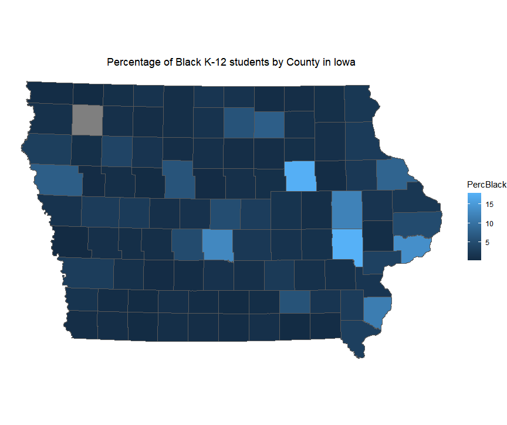

## Assignment 2

#### *Files used for this assignment are located in <a href="https://github.com/son1101/LA558_Son/tree/main/assignments/assign2" target="_blank">here.</a> 

### 1. Plotting Data in R

Using data sourced from the [Iowa Department of Education](https://educateiowa.gov/data-reporting/education-statistics-pk-12), I downloaded student Enrollment data. I cleaned up the file in [Excel](assign2/LA558_Assign2.xlsx) before bringing it into R, isolating Total K-12, AsianTotal, and BlackTotal by counties. Using the [R](assign2/assign2.R) with pipe function, I calculated the percentage of Asian K-12 students by county in Iowa. I plotted the resulting data on a bar chart using the ggplot. 

### 2. Mapping Data in ArcGIS

Also, I calculated percentage of Black K-12 students by county in Iowa with the same way used for Asians with [R](assign2/assign2.R). And then, I exported the resulting data to [.csv file](assign2/Assign2_ForGIS.csv) with the "write.csv" function. Using [ArcGIS Pro](assign2/assign2), I joined the table to "Iowa Counties" layer after renaming the fields to match. I finally made a map like below:

### 3. Mapping Data in R

The map below was created using the same dataset as the "2. Mapping Data in ArcGIS" above. Here, I then joined the data table to a shapefile of Iowa counties after renaming the fields to match. Using ggplot in R(assign2/assign2.R), I mapping the data and export IT.

