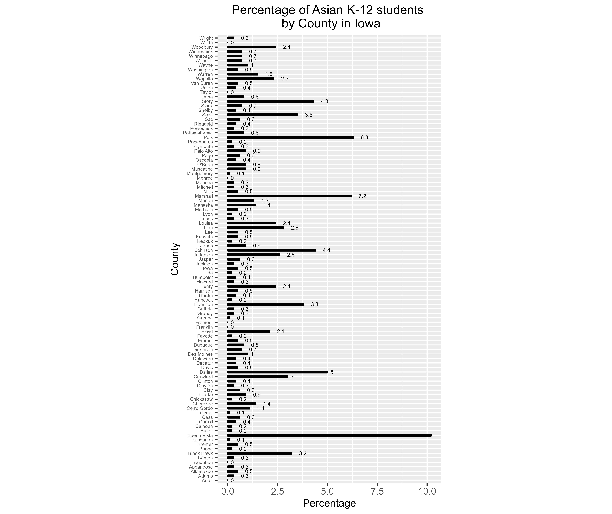

## Assignment 2

### Description

Using data sourced from the [Iowa Department of Education](https://educateiowa.gov/data-reporting/education-statistics-pk-12), I downloaded student Enrollment data. I cleaned up the file in [Excel](assign2/LA558_Assign2.xlsx) before bringing it into R, isolating Total K-12 and Asian Total by counties. Using the [R](assign2/assign2.R) with pipe function, I calculated the percentage of Asian K-12 Students by county in Iowa. I plotted the resulting data on a bar chart using the ggplot. And then, I exported the resulting data to [.csv file](assign2/Assign2_ForGIS.csv) and used it to make a map using [ArcGIS Pro](assign2/assign2).

