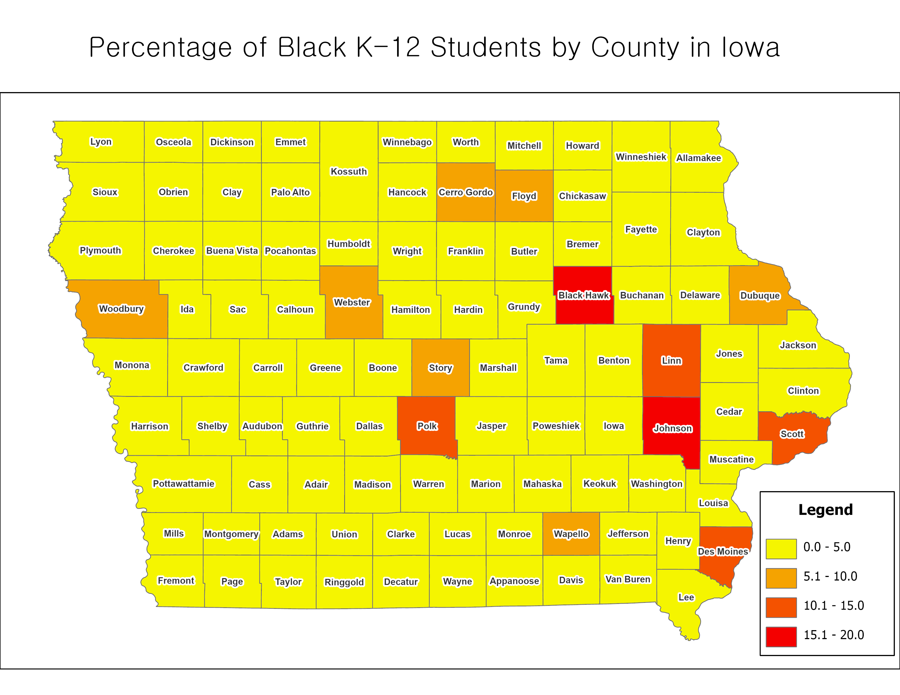

## Assignment 3 (6b)

#### *Files used for this assignment are located in <a href="https://github.com/son1101/LA558_Son/tree/main/assignments/assign3" target="_blank">here (GitHub).</a> 

### 1. Percentage of Workers Using Public Transportation to Work (2021)

I made a map using data sourced from [B08101_001 and B08101_025](https://www.socialexplorer.com/data/ACS2020_5yr/metadata/?ds=ACS20_5yr&var=B08101025) of ACS 5years in [assign3.R](assign3/assign3.R) with TidyCensus. 

### 2. Mapping Data in ArcGIS

Also, I calculated percentage of Black K-12 students by county in Iowa with the same way used for Asians with [R](assign2/assign2.R). And then, I exported the resulting data to [Assign2_ForGIS.csv](assign2/Assign2_ForGIS.csv) with the write.csv function. Using [assign2.aprx in assign2 folder](assign2/assign2), I joined the table to "Iowa Counties" layer that I had. I finally made a map like below:

### 3. Mapping Data in R

The map below was created using the same dataset as the "2. Mapping Data in ArcGIS" above. Here, I then joined the data table to a shapefile of Iowa Counties (the one Professor Seeger had provided) after renaming the fields to match. Using ggplot in [assign2.R](assign2/assign2.R), I mapped the data and exported it.

