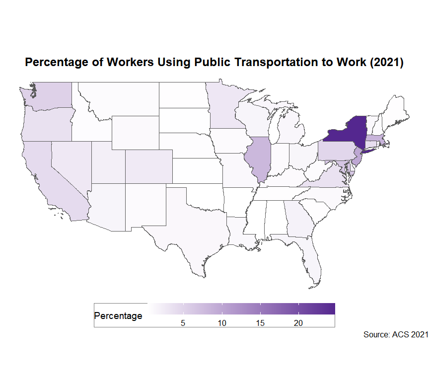
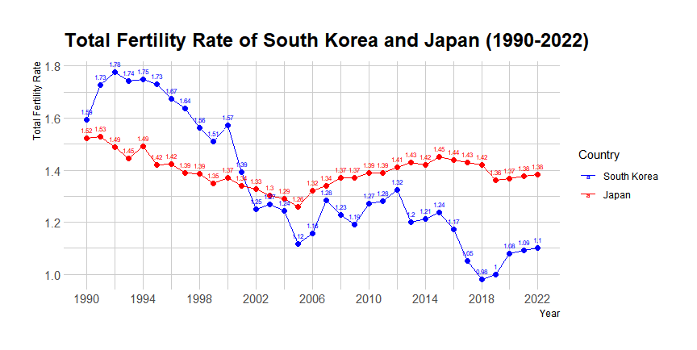
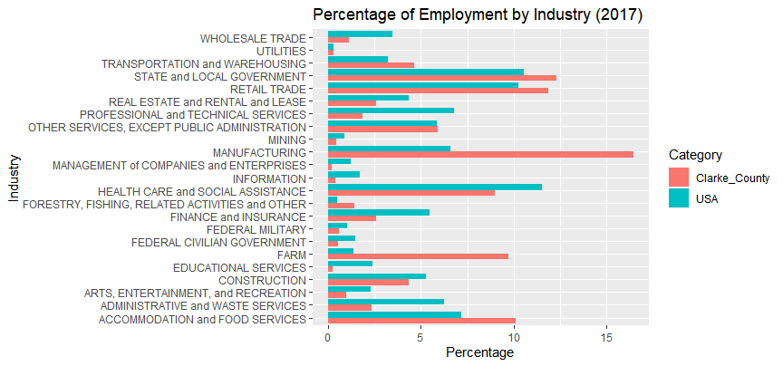

## Assignment 3 (6b)

#### *Files used for this assignment are located in <a href="https://github.com/son1101/LA558_Son/tree/main/assignments/assign3" target="_blank">here (GitHub).</a> 

### 1. A Map Using Variables of Choice From TidyCencus

I made a map using data [B08101_001 and B08101_025](https://www.socialexplorer.com/data/ACS2020_5yr/metadata/?ds=ACS20_5yr&var=B08101025) of ACS 5years using TidyCensus in [assign3.R](assign3/assign3.R).

### 2. A Graph Using the World Data and IDBR Package

I made a graph using idbr package with TFR (Total Fertility Rate) data in [assign3.R](assign3/assign3.R).

### A Grouped Bar Graph Using .xlsx File.

I made a grouped bar graph using data sourced from my CRP566: Policy Analysis and Planning class. I cleaned up the data in [assign.xlsx](assign3/assign3.xlsx) before bringing it into R. Using the [assign3.R](assign3/assign3.R), I plotted the resulting data on a grouped bar graph using the ggplot. 

