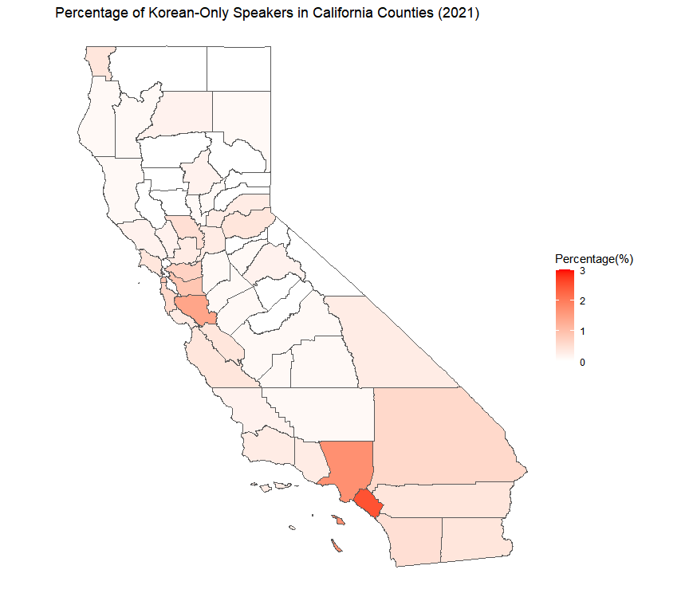

## Exercise 6a 

#### *Files used for this exercise are located in <a href="https://github.com/son1101/LA558_Son/tree/main/exercises/6a_exercise" target="_blank">here.</a> 

I created a map showing the percentage of Korean-Only Speakers at home by county in California as of 2021. I used a dataset from the 2021 ACS5 in [R with Tidycensus](/Exercise6a.R).

